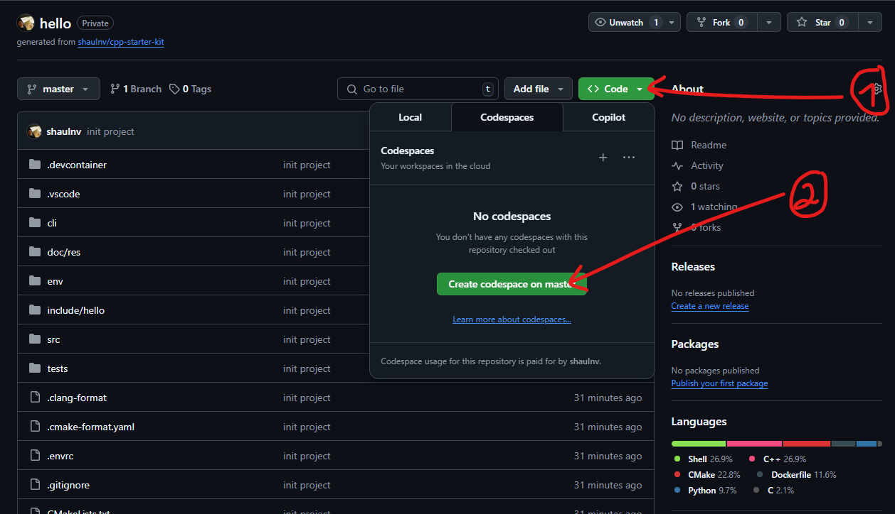

# C++ Project Starter Kit

## Create a new project
>
> Tip: To quickly create a new project, run (uses [`gh`](https://cli.github.com/)):
>
> ```shell
>   # put your project name here:
>   (export project=<project name here> && gh repo create $project --private --clone --template shaulnv/cpp-starter-kit && cd $project && ./init.sh)
>   ```
>
Or, do it manually:

1. Use this template to create a new repository for your project.
2. Clone your repository locally.
3. In the project root, run `./init.sh`.
   This script will replace all `starterkit` placeholders with your project name, commits the changes, and prepare your project for development.

## Project Structure

This project uses [Conan](https://conan.io/) and [CMake](https://cliutils.gitlab.io/modern-cmake/README.html). It includes:

1. **Library** - Core logic implementation ([./src](./src)).
2. **CLI** - Command-line interface for your library ([./cli](./cli)).
3. **Tests** - Test suite using [doctest](https://github.com/doctest/doctest) ([./tests](./tests)).

## Philosophy

A software project should adhere to have distinct high-level components.
This is why we have a Library part and a CLI part.
The Library should consist of pure logic as much as possible.
The CLI is (more) platform-specific, as Linux, Windows, and Mac support it, while HTML/Android/iOS does not.

In that spirit, the project should aim to be cross-platform.
When supporting different platforms,
it becomes clearer to distinguish between logical components and platform-specific components.
The roject currently supports both native (Linux) and WebAssembly
(via Node.js, with HTML support planned for the future) platforms.

## Build & Dev

1. Install dependencies:
   - Development Environment: [`./setup.sh`](./setup.sh).
   - Build Environment: only `curl` and a `C++ compiler` ([`./build.sh`](./build.sh) will install the rest).
2. Activate the [virtual environment](https://www.youtube.com/watch?app=desktop&v=Y21OR1OPC9A): `source ./activate.sh` (run this in each new shell session).
3. Build the project: `./build.sh [--clean] [--release | --debug] [--profile=native|wasm|clang-tidy]`
   > NOTE: Flags are cached, so you can give them only when changing them.  
   > Defaults are: `--debug`, `--profile=native`.  
4. Run the CLI: `./run.sh [-h]`.
5. Run tests: `./test.sh`.
6. Dependencies:  
   The [conanfile.py](./conanfile.py) is the high level build script.  
   To add 3rd party C++ packages, set it in the ['requires'](./conanfile.py#L22) attribute.  
   After you add them there, you can use them in `CMakeLists.txt` files with standard [find_package](https://www.youtube.com/watch?v=1HjAYqcJwV8).  
   You can see an example of the [fmt](https://fmt.dev/11.0/) library, in: [conanfile.py](./conanfile.py#L22), [CMakeLists.txt](./src/CMakeLists.txt#L1), and then in [code](./cli/src/main-cli.cpp#L40).

## VS Code Integration

### Workspace

> NOTE: Run `>CMake ...` means to run the command `CMake: ...` from the VSCode's Command Palette (`Ctrl+Shift+P`)

1. Open `./starterkit.code-workspace` in VS Code.
2. Run `./build.sh` once to generate the CMake build folder.
   > NOTE: if you have issues with the next step, try refreshing VSCode: `>Developer: Reload Window`
3. Choose what to run/debug:
   - `>CMake: Select Configure Preset`
     Choose the `conan-release` or `conan-debug` preset.
   - `>CMake: Set Build Target`
     Choose the target to build (recommended: `all`).
   - `>CMake: Set Launch/Debug Target`
     Select the _current_ target:
     - `starterkit-cli` to run/debug the `CLI`.
     - `starterkit-tests` to run/debug the `unit-tests`.
4. With the selected target you can:
   1. Press `F7` to build
   2. Press `Ctrl+F5` to run
   3. Press `F5` to debug
5. Run `>CMake: Reveal Test Explorer` to run specific tests. use the `TestMate C++` section.
   - Start/Stop continues test watch on each build (the  icon):  
      
   - Go to `starterkit-test.cpp`, hover ovet the green / to the left of each test:  
      
   - Some shortcuts:
      - `Ctrl+; Ctrl+C`: Debug test at cursor
      - `Ctrl+; Ctrl+F`: Debug tests in current file

### Dev Container

1. Open the project in VS Code.
2. Run `>Dev Container: Open workspace in container`.  
   This will start a container with the project opened, with all the dependencies installed.  
   First time may take some time (Docker's image build will take about 2 minutes).  
   You can use it to develop the project without the need to install the dependencies on your machine.  

### GitHub Codespaces

1. You can use [GitHub Codespaces](https://github.com/features/codespaces) to develop the project.
2. Just go to your GitHub repo and click on the `Code` button.  
   

## Small Features

1. [**`direnv` Support**](https://direnv.net/): The repository includes a `.envrc` file for `direnv` integration.
   To enable it:
   1. Install `direnv`:

      ```bash
      apt install direnv
      ```

   2. Add the hook to your `.bashrc` file:

      ```bash
      # Enable direnv (place after rvm, git-prompt, or similar extensions)
      eval "$(direnv hook bash)"
      export DIRENV_LOG_FORMAT=""  # Suppress direnv output
      ```

   3. Run `direnv allow /path/to/project` once, to enable `direnv`.

   Now, upon navigating to `starterkit` (`cd starterkit`), the virtual environment will be activated automatically, making all tools in the venv available seamlessly.
