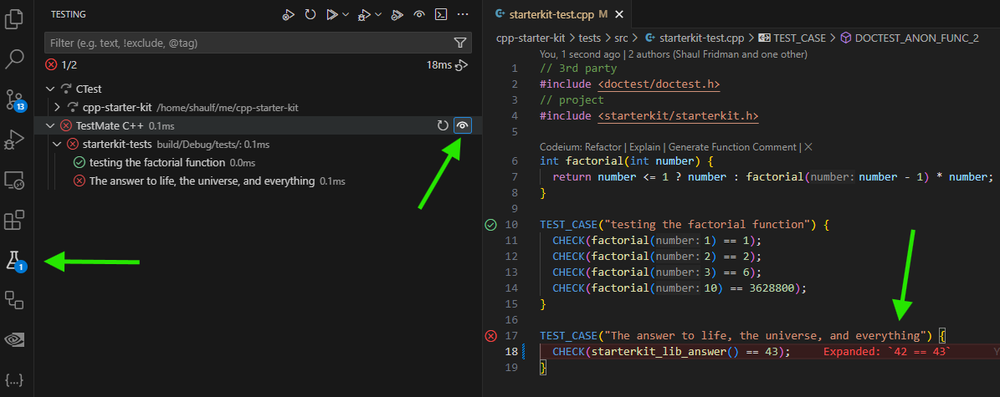

# C++ Project Starter Kit

## Getting Started

### Initial Setup
>
> Tip: To quickly create a new project, run (uses [`gh`](https://cli.github.com/)):
>
> ```shell
>   # put your project name here:
>   (export project=<project name here> && gh repo create $project --private --clone --template shaulnv/cpp-starter-kit && cd $project && ./init.sh)
>   ```  
>
Or, do it manualy:

1. Use this template to create a new repository for your project.
2. Clone your repository locally.
3. In the project root, run `./init.sh`.  
   This script will replace all `starterkit` placeholders with your project name, commits the changes, and prepare your project for development.

### Project Structure

This project uses [Conan](https://conan.io/) and [CMake](https://cliutils.gitlab.io/modern-cmake/README.html). It includes:

1. **Library** - Core logic implementation ([./src](./src)).
2. **CLI** - Command-line interface for your library ([./cli](./cli)).
3. **Tests** - Test suite using [doctest](https://github.com/doctest/doctest) ([./tests](./tests)).

### Build & Dev

1. Activate the [virtual environment](https://www.youtube.com/watch?app=desktop&v=Y21OR1OPC9A): `source ./activate.sh` (run this in each new shell session).
2. Build the project: `./build.sh [--release | --debug]` (default is `--debug`).  
You'l need the `--release/--debug` flag only to change the build type, so call it once, and then just run `./build.sh`.  
3. Run tests: `./test.sh`.  
4. Dependencies:  
The [conanfile.py](./conanfile.py) is the high level build script.  
To add 3rd party C++ packages, set it in the ['requires'](https://github.com/shaulnv/cpp-starter-kit/blob/e8b60c71d5887fe0f32521f704d1a818593b6a70/conanfile.py#L22) attribute.  
After you add them there, you can use them in `CMakeLists.txt` files with standard [find_package](https://www.youtube.com/watch?v=1HjAYqcJwV8).  
You can see an example of the [fmt](https://fmt.dev/11.0/) library, in:
[conanfile.py](https://github.com/shaulnv/cpp-starter-kit/blob/e8b60c71d5887fe0f32521f704d1a818593b6a70/conanfile.py#L22),
[CMakeLists.txt](https://github.com/shaulnv/cpp-starter-kit/blob/e8b60c71d5887fe0f32521f704d1a818593b6a70/src/CMakeLists.txt#L1), and then in
[code](https://github.com/shaulnv/cpp-starter-kit/blob/9ac5e1ead17a929586de92b2938d470307120e31/cli/src/main-cli.cpp#L31).

## VS Code Integration

1. Open `./starterkit.code-workspace` in VS Code.
2. Run `./build.sh` once to generate the CMake build folder.
3. From the Command Palette (`Ctrl+P`) run `CMake: Set Build Target`  
   Choose the target to build (recomended: `all`).
4. From the Command Palette (`Ctrl+P`) run `CMake: Set Launch/Debug Target`  
   Select current target:
   - `starterkit-cli` to run/debug the CLI.
   - `starterkit-tests` to run/debug the unit-tests.  
5. With the selected target you can:
   1. Press `F7` to build
   2. Press `Ctrl+F5` to run
   3. Press `F5` to debug
6. Run `CMake: Reveal Test Explorer` to run spesific tests. use the `TestMate C++` section.  
   - Start/Stop continues test watch on each build (the  icon):  
        
   - Go to `starterkit-test.cpp`, hover ovet the green / to the left of each test:  
        
   - Some shortcuts:  
      - `Ctrl+; Ctrl+C`: Debug test at cursor
      - `Ctrl+; Ctrl+F`: Debug tests in current file

## Small Features

1. [**`direnv` Support**](https://direnv.net/): The repository includes a `.envrc` file for `direnv` integration.  
   To enable it:
   1. Install `direnv`:  

      ```bash
      apt install direnv
      ```

   2. Add the hook to your `.bashrc` file:  

      ```bash
      # Enable direnv (place after rvm, git-prompt, or similar extensions)
      eval "$(direnv hook bash)"  
      export DIRENV_LOG_FORMAT=""  # Suppress direnv output
      ```

   3. Run `direnv allow /path/to/project` once, to enable `direnv`.

   Now, upon navigating to `starterkit` (`cd starterkit`), the virtual environment will be activated automatically, making all tools in the venv available seamlessly.
